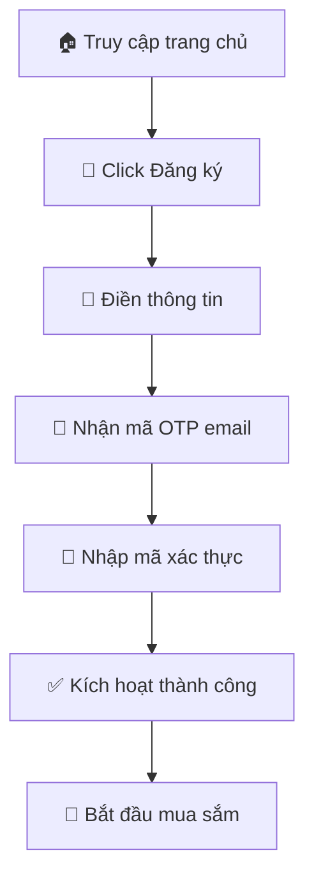
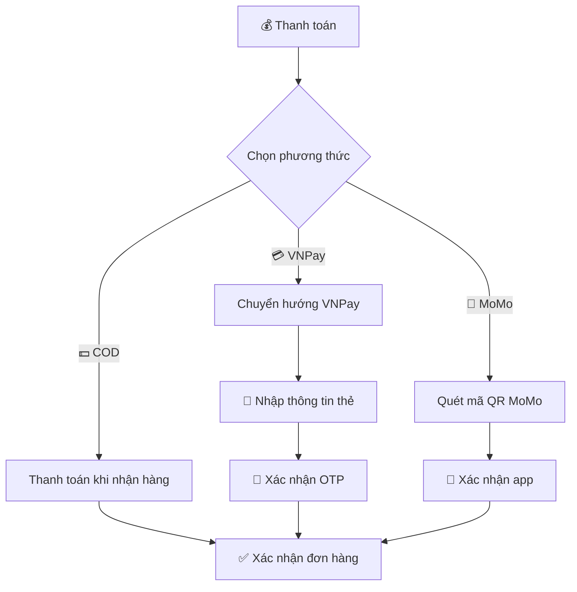
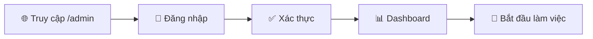
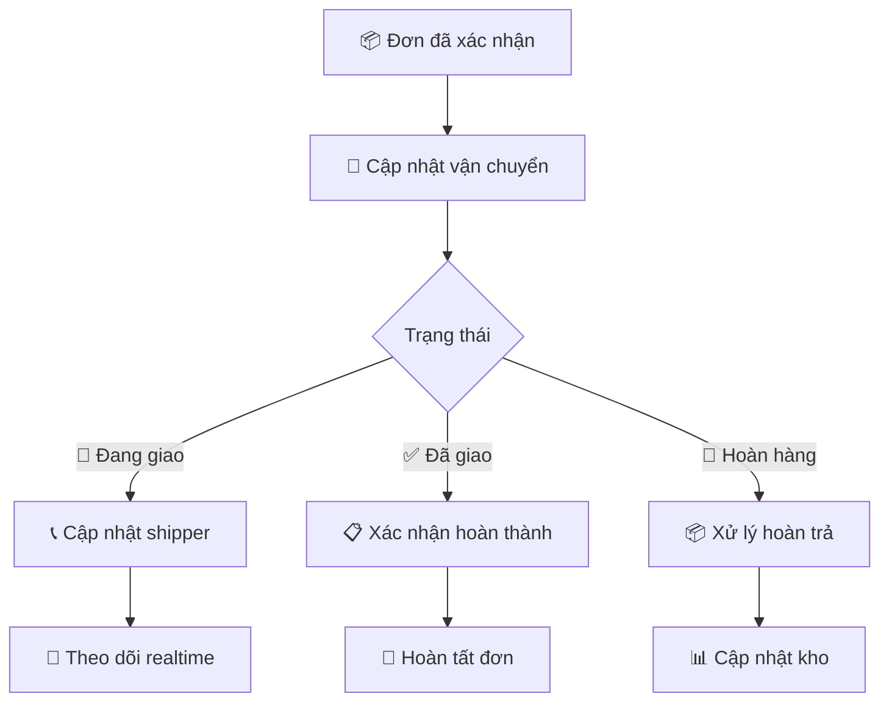
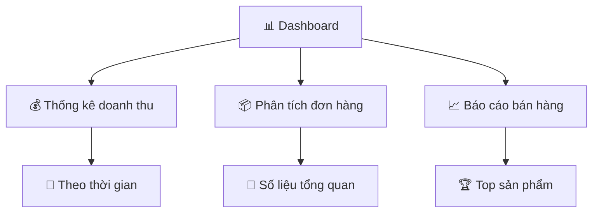
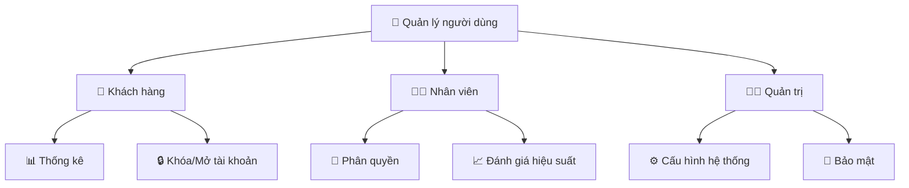
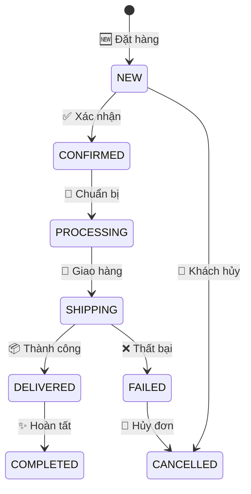

# 🐾 Pet Shop Application

<div align="center">


**Nền tảng quản lý cửa hàng thú cưng toàn diện - Nơi chăm sóc thú cưng tốt nhất**

[🚀 Bắt đầu ngay](#-cài-đặt-nhanh) • [📖 Hướng dẫn](#-hướng-dẫn-sử-dụng) • [🛠 Hỗ trợ](#-hỗ-trợ)

</div>

## 📋 Giới thiệu

Chào mừng bạn đến với **Pet Shop** - Giải pháp quản lý cửa hàng thú cưng toàn diện! 🎉

Ứng dụng được phát triển bằng Spring Boot, mang đến trải nghiệm mua sắm tuyệt vời và hệ thống quản lý chuyên nghiệp cho cộng đồng yêu thú cưng.

### 👥 Vai trò trong hệ thống

<div align="center">

| Vai trò | Icon | Mô tả | Quyền hạn chính |
|---------|------|-------|-----------------|
| **Khách hàng** | 👤 | Người dùng mua sắm | Mua hàng, theo dõi đơn, đánh giá |
| **Nhân viên** | 👨‍💼 | Quản lý vận hành | Xử lý đơn hàng, hỗ trợ khách |
| **Quản trị** | 👨‍💻 | Quản lý hệ thống | Toàn quyền quản trị |

</div>

## 🚀 Cài đặt nhanh

### 📋 Yêu cầu hệ thống
- **JDK 8+** (Khuyến nghị JDK 11)
- **Maven 3.6+**
- **SQL Server 2012+**
- **IDE**: IntelliJ IDEA hoặc Eclipse

### ⚙️ Các bước triển khai

```bash
# 1. Clone dự án
git clone https://github.com/your-repo/pet-shop.git

# 2. Cấu hình database
# Tạo database DTA_PET trong SQL Server

# 3. Cập nhật cấu hình
# File: src/main/resources/application.properties
spring.datasource.url=jdbc:sqlserver://localhost:1433;databaseName=DTA_PET
spring.datasource.username=sa
spring.datasource.password=123456

# 4. Chạy ứng dụng
mvn spring-boot:run

# 5. Truy cập
# Frontend: http://localhost:8080
# Admin:    http://localhost:8080/admin
```

## 📚 Hướng dẫn sử dụng

### 🛍️ Dành cho Khách hàng

<details>
<summary><b>🎯 Trải nghiệm mua sắm toàn diện</b></summary>

#### 🔐 Đăng ký tài khoản



**Thông tin đăng ký:**
- 👤 Họ tên (bắt buộc)
- 📧 Email đăng nhập
- 📱 Số điện thoại
- 🔒 Mật khẩu (tối thiểu 6 ký tự)

#### 🛒 Quy trình mua hàng

<div align="center">

| Bước | Thao tác | Mô tả |
|------|----------|--------|
| 1️⃣ | 🔍 Tìm sản phẩm | Lướt shop, tìm kiếm, lọc danh mục |
| 2️⃣ | 📖 Xem chi tiết | Thông tin, giá, tồn kho, đánh giá |
| 3️⃣ | 🛒 Thêm giỏ hàng | Chọn số lượng, thêm vào giỏ |
| 4️⃣ | 💳 Thanh toán | Chọn phương thức thanh toán |
| 5️⃣ | 📦 Theo dõi đơn | Theo dõi trạng thái đơn hàng |

</div>

#### 💳 Phương thức thanh toán



#### 📦 Theo dõi đơn hàng

<div align="center">

| Trạng thái | Icon | Mô tả | Hành động |
|------------|------|-------|-----------|
| **Chờ xác nhận** | ⏳ | Đơn mới tạo | Có thể hủy |
| **Đang xử lý** | 🔄 | Chuẩn bị hàng | Liên hệ hỗ trợ |
| **Đang giao** | 🚚 | Đang vận chuyển | Theo dõi lộ trình |
| **Đã giao** | ✅ | Giao thành công | Đánh giá sản phẩm |
| **Đã hủy** | ❌ | Đơn bị hủy | Xem lý do |

</div>

</details>

### 👨‍💼 Dành cho Nhân viên

<details>
<summary><b>🛠️ Quản lý vận hành</b></summary>

#### 🔐 Truy cập hệ thống



#### 📦 Quản lý đơn hàng

<div align="center">

| Chức năng | Icon | Thao tác | Mô tả |
|-----------|------|----------|--------|
| **Xem danh sách** | 📋 | Lọc & Tìm kiếm | Quản lý theo trạng thái |
| **Xác nhận đơn** | ✅ | Duyệt đơn mới | Kiểm tra thông tin |
| **In hóa đơn** | 🖨️ | Xuất PDF | Tạo hóa đơn |
| **Cập nhật trạng thái** | 🔄 | Thay đổi trạng thái | Theo dõi tiến độ |

</div>

#### 🚚 Quản lý giao hàng



#### 💬 Hỗ trợ khách hàng

<div align="center">

| Nhiệm vụ | Icon | Tiêu chuẩn | Thời gian |
|----------|------|------------|-----------|
| **Tiếp nhận yêu cầu** | 📩 | Phân loại chi tiết | 5 phút |
| **Phản hồi khách** | 💬 | Thân thiện, chuyên nghiệp | 15 phút |
| **Giải quyết vấn đề** | ✅ | Theo dõi đến hoàn thành | 24-48h |

</div>

</details>

### 👨‍💻 Dành cho Quản trị

<details>
<summary><b>⚙️ Quản trị hệ thống</b></summary>

#### 📊 Dashboard & Báo cáo



#### 🛍️ Quản lý sản phẩm

<div align="center">

| Tính năng | Icon | Mô tả | Quyền hạn |
|-----------|------|-------|------------|
| **Thêm sản phẩm** | ➕ | Tạo sản phẩm mới | ADMIN |
| **Chỉnh sửa** | ✏️ | Cập nhật thông tin | ADMIN, STAFF |
| **Quản lý kho** | 📦 | Theo dõi tồn kho | ADMIN, STAFF |
| **Khuyến mãi** | 🎁 | Quản lý chương trình KM | ADMIN |

</div>

#### 👥 Quản lý người dùng



#### 🔐 Phân quyền hệ thống

<div align="center">

| Module | 👤 User | 👨‍💼 Staff | 👨‍💻 Admin |
|--------|---------|-----------|------------|
| **Xem sản phẩm** | ✅ | ✅ | ✅ |
| **Đặt hàng** | ✅ | ✅ | ✅ |
| **Quản lý đơn** | ⚡ | ✅ | ✅ |
| **Quản lý sản phẩm** | ❌ | ⚡ | ✅ |
| **Quản lý người dùng** | ❌ | ❌ | ✅ |
| **Cấu hình hệ thống** | ❌ | ❌ | ✅ |

</div>

> **Chú thích:** ✅ Toàn quyền • ⚡ Hạn chế • ❌ Không truy cập

</details>

## 🛡️ Bảo mật & Bảo mật

### 🔒 Hệ thống bảo mật

<div align="center">

| Lớp bảo mật | Công nghệ | Mô tả |
|-------------|-----------|--------|
| **Xác thực** | JWT + Spring Security | Quản lý phiên đăng nhập |
| **Mã hóa** | BCrypt | Bảo vệ mật khẩu |
| **API Security** | Spring Security | Bảo vệ API endpoints |
| **Data Protection** | HTTPS + Encryption | Mã hóa dữ liệu nhạy cảm |

</div>

### 📦 Quy trình xử lý đơn hàng



## 🐛 Xử lý sự cố

### 🔧 Sự cố thường gặp

<details>
<summary><b>💾 Lỗi database</b></summary>

**Triệu chứng:**
- Ứng dụng không khởi động
- Lỗi kết nối SQL Server

**Giải pháp:**
```bash
# 1. Kiểm tra SQL Server
sudo systemctl status mssql-server

# 2. Kiểm tra kết nối
telnet localhost 1433

# 3. Kiểm tra database
sqlcmd -S localhost -U sa -Q "SELECT name FROM sys.databases"
```
</details>

<details>
<summary><b>💳 Lỗi thanh toán</b></summary>

**Triệu chứng:**
- Giao dịch thất bại
- Lỗi cổng thanh toán

**Giải pháp:**
1. Kiểm tra cấu hình VNPay/MoMo
2. Xác nhận callback URL
3. Kiểm tra log thanh toán
4. Liên hệ nhà cung cấp

```properties
# Kiểm tra cấu hình
vnpay.return.url=http://localhost:8080/payment/vnpay-callback
momo.return.url=http://localhost:8080/payment/momo-callback
```
</details>

<details>
<summary><b>📤 Lỗi upload file</b></summary>

**Triệu chứng:**
- Không thể tải ảnh lên
- Lỗi kích thước file

**Giải pháp:**
```bash
# 1. Kiểm tra thư mục uploads
ls -la uploads/

# 2. Kiểm tra quyền
chmod 755 uploads/
chmod 755 uploads/images/

# 3. Kiểm tra dung lượng
# File tối đa 10MB
```
</details>

## 📞 Hỗ trợ & Liên hệ

<div align="center">

| Kênh hỗ trợ | Thông tin | Thời gian làm việc |
|-------------|-----------|-------------------|
| 📧 **Email** | support@petshop.com | 24/7 |
| ☎️ **Hotline** | 1800-xxxx | 8:00 - 22:00 |
| 💬 **Live Chat** | Website/App | 24/7 |
| 📱 **Zalo OA** | @petshop | 8:00 - 21:00 |

</div>

### 🕒 Thời gian phản hồi

<div align="center">

| Mức độ | Thời gian | Phương thức ưu tiên |
|--------|-----------|---------------------|
| ⚡ **Khẩn cấp** | 15 phút | Hotline |
| 🔄 **Thông thường** | 2 giờ | Email, Live Chat |
| 📝 **Góp ý** | 24 giờ | Email |

</div>

## 🎯 Tính năng nổi bật

### ✨ Cho khách hàng
- 🛒 **Mua sắm đa kênh**: Web, Mobile-friendly
- 💳 **Thanh toán linh hoạt**: COD, VNPay, MoMo
- 📦 **Theo dõi realtime**: Cập nhật trạng thái đơn hàng
- ⭐ **Đánh giá & Review**: Chia sẻ trải nghiệm

### 🛠️ Cho quản lý
- 📊 **Dashboard thông minh**: Thống kê trực quan
- 🔔 **Thông báo tự động**: Email, Notification
- 📈 **Báo cáo chi tiết**: Doanh thu, sản phẩm, khách hàng
- 🔐 **Bảo mật đa tầng**: Phân quyền chi tiết

### ⚡ Hiệu suất
- 🚀 **Tốc độ cao**: Spring Boot optimization
- 📱 **Responsive**: Tương thích mọi thiết bị
- 🔄 **Real-time**: Cập nhật thời gian thực
- 💾 **Bảo mật**: Mã hóa toàn diện

---

<div align="center">

## 🎊 Cảm ơn bạn đã chọn Pet Shop! 🐾

**Mang đến hạnh phúc cho thú cưng - Trao gửi yêu thương đến gia đình bạn**

*© 2024 Pet Shop Application. All rights reserved.*

[⬆️ Về đầu trang](#-pet-shop-application)

</div>
