# 🐾 Pet Shop Application

<div align="center">


**Hệ thống quản lý cửa hàng thú cưng hiện đại và toàn diện**

[🚀 Bắt đầu](#-cài-đặt-và-chạy-ứng-dụng) • [📚 Tài liệu](#-hướng-dẫn-sử-dụng-chi-tiết) • [💬 Hỗ trợ](#-hỗ-trợ-và-liên-hệ)

</div>

---

## 📋 Tổng quan

Pet Shop là ứng dụng web quản lý cửa hàng thú cưng được phát triển trên nền tảng **Spring Boot**, mang đến trải nghiệm mua sắm trực tuyến tốt nhất cho những người yêu thú cưng. Hệ thống được thiết kế với kiến trúc phân quyền rõ ràng, bảo mật cao và tích hợp đầy đủ các tính năng thanh toán hiện đại.

### ✨ Điểm nổi bật

- 🔐 **Bảo mật cao**: JWT Authentication, BCrypt encryption, 2FA
- 💳 **Đa phương thức thanh toán**: VNPay, MoMo, COD
- 📱 **Responsive Design**: Tối ưu trên mọi thiết bị
- 🚀 **Hiệu năng cao**: Caching, Load balancing, Auto-scaling
- 📊 **Dashboard thống kê**: Realtime analytics & reporting
- 🔔 **Thông báo đa kênh**: Email, SMS, Push notification

---

## 🎯 Phân quyền hệ thống

<div align="center">

| Vai trò | Icon | Mô tả | Quyền hạn chính |
|---------|------|--------|-----------------|
| **CUSTOMER** | 👤 | Khách hàng | Mua sắm, Quản lý đơn hàng, Đánh giá sản phẩm |
| **STAFF** | 👨‍💼 | Nhân viên | Xử lý đơn hàng, Hỗ trợ khách hàng, Cập nhật kho |
| **ADMIN** | 👨‍💻 | Quản trị viên | Toàn quyền quản lý hệ thống |

</div>

---

## 🛠️ Công nghệ sử dụng

<div align="center">

### Backend


### Database & Cache


### Payment Gateway


### Tools & DevOps


</div>

---

## 📦 Yêu cầu hệ thống

```yaml
Runtime:
  - Java JDK: >= 8
  - Maven: >= 3.6.0
  - SQL Server: >= 2016
  
Development:
  - IDE: IntelliJ IDEA / Eclipse
  - RAM: >= 4GB
  - Disk: >= 10GB free space
  
Optional:
  - Docker: >= 20.10
  - Redis: >= 6.0
```

---

## 🚀 Cài đặt và chạy ứng dụng

### 📥 Bước 1: Clone Repository

```bash
git clone https://github.com/your-repo/pet-shop.git
cd pet-shop
```

### 🗄️ Bước 2: Cấu hình Database

**Tạo database trong SQL Server:**
```sql
CREATE DATABASE DTA_PET;
```

**Cập nhật `application.properties`:**
```properties
# Database Configuration
spring.datasource.url=jdbc:sqlserver://localhost:1433;databaseName=DTA_PET
spring.datasource.username=sa
spring.datasource.password=your_password
spring.datasource.driver-class-name=com.microsoft.sqlserver.jdbc.SQLServerDriver

# JPA Configuration
spring.jpa.hibernate.ddl-auto=update
spring.jpa.show-sql=true
spring.jpa.properties.hibernate.format_sql=true

# File Upload
spring.servlet.multipart.max-file-size=10MB
spring.servlet.multipart.max-request-size=10MB

# Email Configuration
spring.mail.host=smtp.gmail.com
spring.mail.port=587
spring.mail.username=your-email@gmail.com
spring.mail.password=your-app-password
spring.mail.properties.mail.smtp.auth=true
spring.mail.properties.mail.smtp.starttls.enable=true
```

### ▶️ Bước 3: Chạy ứng dụng

**Sử dụng Maven:**
```bash
mvn clean install
mvn spring-boot:run
```

**Hoặc chạy file JAR:**
```bash
java -jar target/pet-shop-1.0.0.jar
```

### 🌐 Bước 4: Truy cập ứng dụng

- **Frontend**: http://localhost:8080
- **Admin Panel**: http://localhost:8080/admin
- **API Documentation**: http://localhost:8080/swagger-ui.html

---

## 📚 Hướng dẫn sử dụng chi tiết

### 🛍️ Dành cho KHÁCH HÀNG

<details>
<summary><b>🔐 Đăng ký & Đăng nhập</b></summary>

#### Quy trình đăng ký:

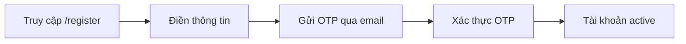

**Thông tin cần thiết:**
- 👤 Họ và tên
- 📧 Email (dùng để đăng nhập)
- 📱 Số điện thoại
- 🔒 Mật khẩu (tối thiểu 8 ký tự)

#### Đăng nhập:
1. Truy cập `/login`
2. Nhập email và mật khẩu
3. ✅ Tích "Ghi nhớ đăng nhập" (tùy chọn)
4. Click **Đăng nhập**

</details>

<details>
<summary><b>🛒 Mua sắm & Thanh toán</b></summary>

#### Quy trình mua hàng:

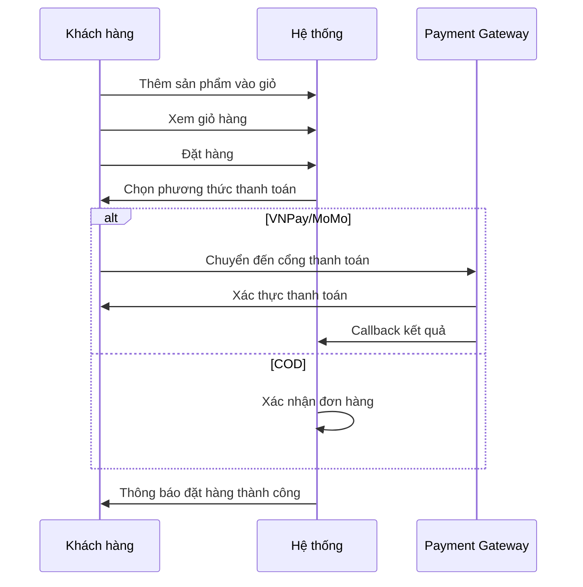

#### Phương thức thanh toán:

| Phương thức | Icon | Mô tả | Thời gian xử lý |
|-------------|------|--------|-----------------|
| **COD** | 💵 | Thanh toán khi nhận hàng | Tức thì |
| **VNPay** | 💳 | Thẻ ATM/Credit Card | 1-2 phút |
| **MoMo** | 📱 | Ví điện tử MoMo | 1-2 phút |

</details>

<details>
<summary><b>📦 Quản lý đơn hàng</b></summary>

#### Vòng đời đơn hàng:

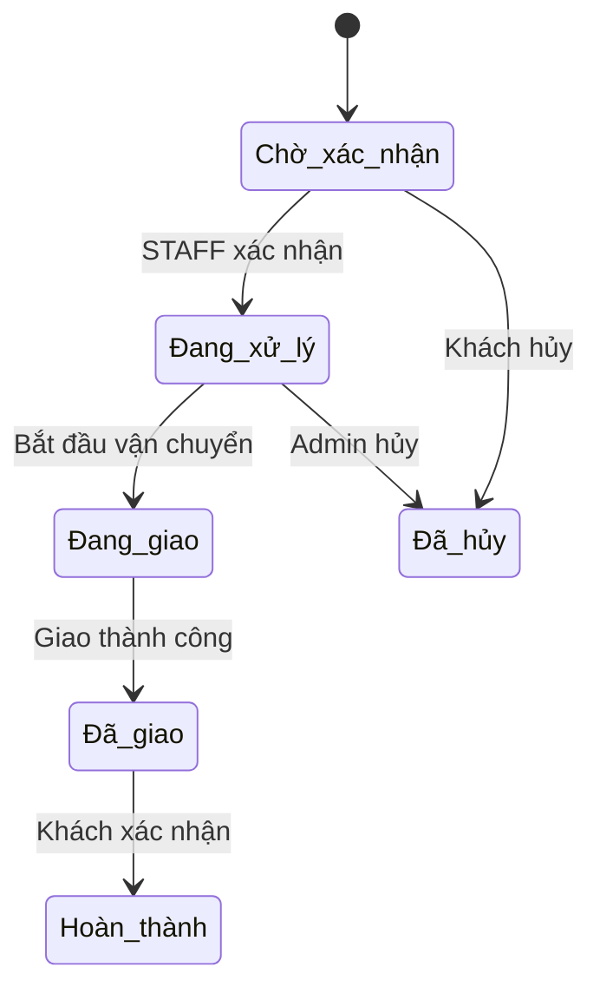

#### Các tính năng:
- 📋 Xem lịch sử đơn hàng
- 🔍 Theo dõi trạng thái realtime
- ❌ Hủy đơn (khi chưa xử lý)
- ⭐ Đánh giá sản phẩm (sau khi nhận hàng)
- 📞 Liên hệ hỗ trợ

</details>

### 👨‍💼 Dành cho NHÂN VIÊN

<details>
<summary><b>📊 Quản lý đơn hàng</b></summary>

#### Nhiệm vụ chính:

| Chức năng | Mô tả | Phím tắt |
|-----------|--------|----------|
| ✅ Xác nhận đơn | Kiểm tra & xác nhận đơn mới | `Ctrl + Y` |
| 📦 Chuẩn bị hàng | Đóng gói & chuẩn bị vận chuyển | `Ctrl + P` |
| 🚚 Cập nhật giao hàng | Theo dõi & cập nhật trạng thái | `Ctrl + U` |
| 🖨️ In hóa đơn | Xuất hóa đơn PDF | `Ctrl + I` |
| 📝 Ghi chú | Thêm ghi chú cho đơn hàng | `Ctrl + N` |

#### Quy trình xử lý:

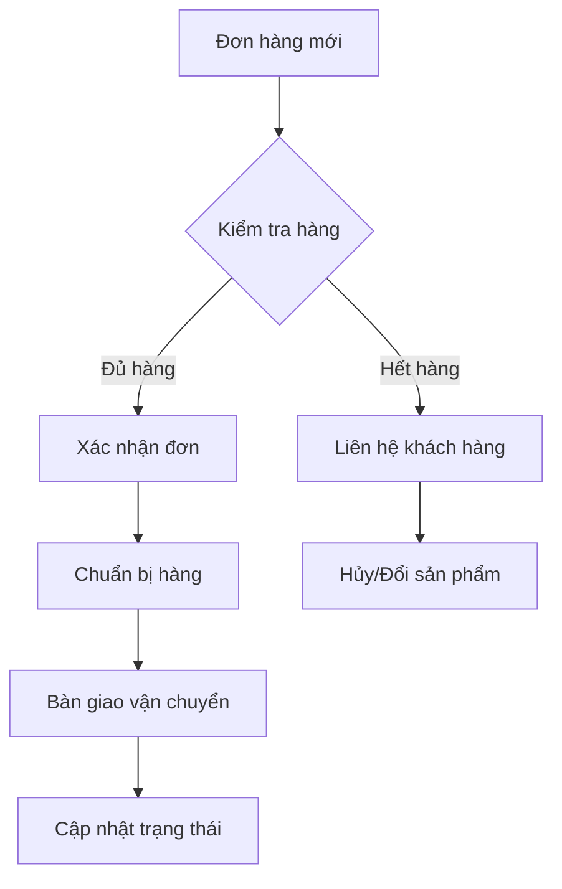

</details>

<details>
<summary><b>💬 Hỗ trợ khách hàng</b></summary>

#### Kênh hỗ trợ:

- 📧 **Email**: Trả lời câu hỏi qua email
- 💬 **Live Chat**: Chat trực tiếp trên website
- 📱 **Hotline**: Tư vấn qua điện thoại
- 🔄 **Khiếu nại**: Xử lý khiếu nại & hoàn tiền

#### SLA (Service Level Agreement):

| Loại yêu cầu | Thời gian phản hồi | Thời gian giải quyết |
|--------------|-------------------|---------------------|
| Khẩn cấp | ⚡ 15 phút | 2 giờ |
| Thông thường | 🔄 2 giờ | 24 giờ |
| Góp ý | 📝 24 giờ | 3-5 ngày |

</details>

### 👨‍💻 Dành cho QUẢN TRỊ VIÊN

<details>
<summary><b>📊 Dashboard & Thống kê</b></summary>

#### Các chỉ số quan trọng (KPIs):

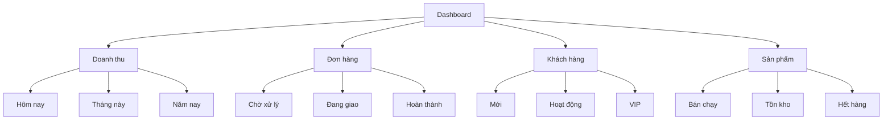

#### Báo cáo:

- 📈 **Doanh thu**: Theo ngày/tuần/tháng/năm
- 📊 **Sản phẩm**: Top bán chạy, tồn kho
- 💳 **Thanh toán**: Phân tích theo phương thức
- 👥 **Khách hàng**: Phân tích hành vi mua hàng

</details>

<details>
<summary><b>🛍️ Quản lý sản phẩm</b></summary>

#### Chức năng đầy đủ:

| Tính năng | Mô tả | Quyền hạn |
|-----------|--------|-----------|
| ➕ Thêm mới | Tạo sản phẩm mới | Admin only |
| ✏️ Chỉnh sửa | Cập nhật thông tin | Admin, Staff* |
| 🗑️ Xóa | Xóa sản phẩm | Admin only |
| 🖼️ Quản lý ảnh | Upload/Delete ảnh | Admin, Staff |
| 💰 Giá & KM | Cập nhật giá & khuyến mãi | Admin only |
| 📦 Kho | Nhập/xuất kho | Admin, Staff |

*Staff chỉ được cập nhật số lượng tồn kho

#### Quy trình thêm sản phẩm:

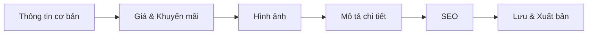

</details>

<details>
<summary><b>👥 Quản lý người dùng</b></summary>

#### Phân quyền chi tiết:

| Module | USER | STAFF | ADMIN |
|--------|------|--------|--------|
| 🛍️ Mua sắm | ✅ | ✅ | ✅ |
| 📦 Đơn hàng (xem) | ⚡ Của mình | ✅ Tất cả | ✅ Tất cả |
| 📦 Đơn hàng (xử lý) | ❌ | ✅ | ✅ |
| 🛍️ Sản phẩm (xem) | ✅ | ✅ | ✅ |
| 🛍️ Sản phẩm (sửa) | ❌ | ⚡ Tồn kho | ✅ |
| 👥 Người dùng | ❌ | ⚡ Xem | ✅ |
| 💰 Tài chính | ❌ | ⚡ Xem | ✅ |
| ⚙️ Cấu hình | ❌ | ❌ | ✅ |

> ✅ Full quyền | ⚡ Giới hạn | ❌ Không có quyền

#### Quản lý tài khoản:

- 👀 Xem danh sách người dùng
- 🔍 Tìm kiếm & lọc
- 🔒 Khóa/Mở khóa tài khoản
- 🔑 Reset mật khẩu
- 📊 Phân tích hành vi
- 🏆 Phân loại khách hàng (Thường, VIP)

</details>

---

## 🔐 Bảo mật & Quyền riêng tư

### 🛡️ Các lớp bảo mật:

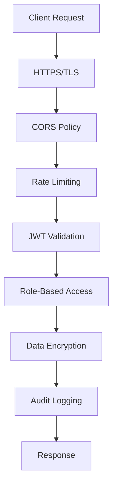

### 🔒 Tính năng bảo mật:

| Tính năng | Công nghệ | Mô tả |
|-----------|-----------|--------|
| 🔐 Xác thực | JWT + OAuth2 | Token-based authentication |
| 🔒 Mã hóa mật khẩu | BCrypt | Mã hóa một chiều |
| 🛡️ API Security | Spring Security | Role-based access control |
| 📱 2FA | Google Authenticator | Xác thực 2 yếu tố |
| 🚫 Rate Limiting | Redis | Chống DDoS |
| 📝 Audit Log | Database | Ghi log mọi hoạt động |

### 🔑 Quản lý Token:

- **Access Token**: Hết hạn sau 24 giờ
- **Refresh Token**: Hết hạn sau 7 ngày
- **Tự động gia hạn**: Khi có hoạt động
- **Blacklist**: Thu hồi token khi logout

---

## 💳 Tích hợp thanh toán

### 🏦 VNPay

```java
// Cấu hình VNPay
vnpay.api.url=https://sandbox.vnpayment.vn/paymentv2/vpcpay.html
vnpay.merchant.id=YOUR_MERCHANT_ID
vnpay.hash.secret=YOUR_HASH_SECRET
vnpay.return.url=http://localhost:8080/payment/vnpay/callback
```

**Quy trình thanh toán:**

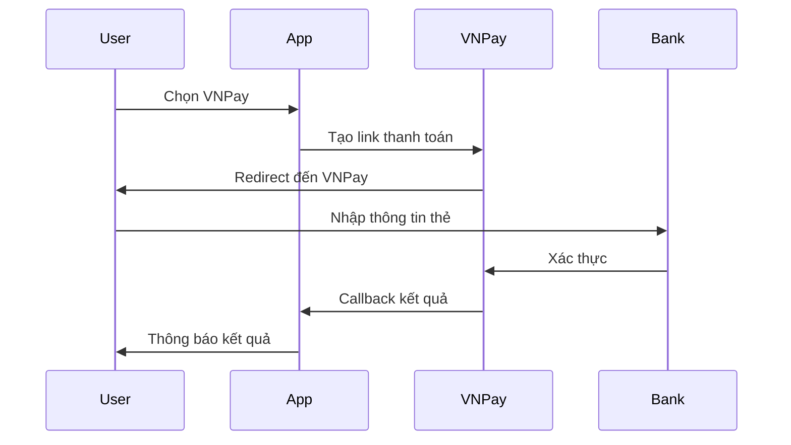

### 📱 MoMo

```java
// Cấu hình MoMo
momo.api.url=https://test-payment.momo.vn/v2/gateway/api/create
momo.partner.code=YOUR_PARTNER_CODE
momo.access.key=YOUR_ACCESS_KEY
momo.secret.key=YOUR_SECRET_KEY
momo.return.url=http://localhost:8080/payment/momo/callback
```

**Quy trình thanh toán:**

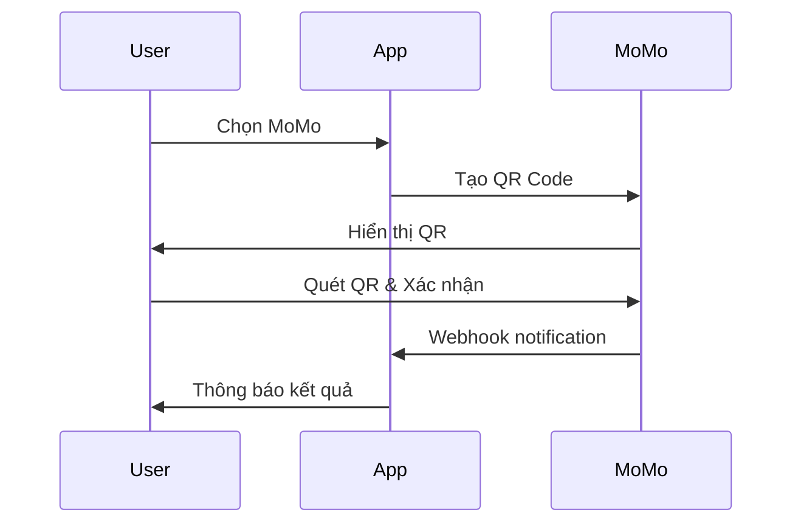

---

## 📧 Cấu hình Email

### SMTP Settings:

```properties
# Gmail SMTP
spring.mail.host=smtp.gmail.com
spring.mail.port=587
spring.mail.username=your-email@gmail.com
spring.mail.password=your-app-password
spring.mail.properties.mail.smtp.auth=true
spring.mail.properties.mail.smtp.starttls.enable=true
spring.mail.properties.mail.smtp.starttls.required=true
spring.mail.properties.mail.smtp.ssl.trust=smtp.gmail.com
```

### Email Templates:

| Template | Mô tả | Kích hoạt |
|----------|--------|-----------|
| 📧 Welcome | Email chào mừng | Đăng ký thành công |
| 🔐 OTP | Mã xác thực | Xác thực tài khoản |
| 📦 Order Confirm | Xác nhận đơn hàng | Đặt hàng thành công |
| 🚚 Shipping | Thông báo giao hàng | Bắt đầu vận chuyển |
| ✅ Delivered | Giao hàng thành công | Hoàn thành đơn |
| 🔄 Refund | Thông báo hoàn tiền | Hủy đơn/Hoàn trả |

---

## 🔧 Xử lý lỗi thường gặp

### 🚨 Database Connection Error

**Triệu chứng:**
```
Cannot create PoolableConnectionFactory
```

**Giải pháp:**
1. Kiểm tra SQL Server đang chạy
2. Verify connection string trong `application.properties`
3. Test connection:
```bash
sqlcmd -S localhost -U sa -P your_password
```

### 💳 Payment Gateway Error

**Triệu chứng:**
```
Payment callback failed / Invalid signature
```

**Giải pháp:**
1. Kiểm tra API credentials
2. Verify callback URL
3. Check hash secret key
4. Review payment logs:
```bash
tail -f logs/payment.log
```

### 📁 File Upload Error

**Triệu chứng:**
```
Maximum upload size exceeded
```

**Giải pháp:**
1. Tăng giới hạn trong `application.properties`:
```properties
spring.servlet.multipart.max-file-size=20MB
spring.servlet.multipart.max-request-size=20MB
```
2. Kiểm tra quyền thư mục `uploads/`
3. Verify disk space

### 🔐 JWT Token Error

**Triệu chứng:**
```
Token expired / Invalid token
```

**Giải pháp:**
1. Xóa token cũ và đăng nhập lại
2. Check token expiration time
3. Verify JWT secret key

---

## 📊 Monitoring & Logging

### 📝 Log Levels:

```properties
# Application Logs
logging.level.root=INFO
logging.level.com.petshop=DEBUG
logging.level.org.springframework.web=DEBUG
logging.level.org.hibernate.SQL=DEBUG

# Log Files
logging.file.name=logs/petshop.log
logging.file.max-size=10MB
logging.file.max-history=30
```

### 📈 Metrics & Health Check:

```yaml
# Actuator Endpoints
management:
  endpoints:
    web:
      exposure:
        include: health,info,metrics,prometheus
  endpoint:
    health:
      show-details: always
```

**Access:**
- Health: http://localhost:8080/actuator/health
- Metrics: http://localhost:8080/actuator/metrics
- Prometheus: http://localhost:8080/actuator/prometheus

---

## 🐳 Docker Deployment

### Dockerfile:

```dockerfile
FROM openjdk:8-jdk-alpine
VOLUME /tmp
COPY target/pet-shop-1.0.0.jar app.jar
ENTRYPOINT ["java","-jar","/app.jar"]
EXPOSE 8080
```

### Docker Compose:

```yaml
version: '3.8'

services:
  petshop-app:
    build: .
    ports:
      - "8080:8080"
    environment:
      - SPRING_DATASOURCE_URL=jdbc:sqlserver://sqlserver:1433;databaseName=DTA_PET
      - SPRING_DATASOURCE_USERNAME=sa
      - SPRING_DATASOURCE_PASSWORD=YourStrong@Passw0rd
    depends_on:
      - sqlserver
      
  sqlserver:
    image: mcr.microsoft.com/mssql/server:2019-latest
    environment:
      - ACCEPT_EULA=Y
      - SA_PASSWORD=YourStrong@Passw0rd
    ports:
      - "1433:1433"
    volumes:
      - sqlserver-data:/var/opt/mssql

volumes:
  sqlserver-data:
```

**Chạy với Docker:**
```bash
docker-compose up -d
```

---

## 🧪 Testing

### Unit Tests:

```bash
mvn test
```

### Integration Tests:

```bash
mvn verify
```

### Coverage Report:

```bash
mvn clean test jacoco:report
```

Xem report tại: `target/site/jacoco/index.html`

---

## 📱 API Documentation

### Swagger UI:

Truy cập: http://localhost:8080/swagger-ui.html

### Postman Collection:

Import file: `docs/PetShop-API.postman_collection.json`

### API Endpoints chính:

| Category | Method | Endpoint | Auth |
|----------|--------|----------|------|
| 🔐 Auth | POST | `/api/auth/register` | ❌ |
| 🔐 Auth | POST | `/api/auth/login` | ❌ |
| 🛍️ Product | GET | `/api/products` | ❌ |
| 🛍️ Product | POST | `/api/products` | ✅ Admin |
| 🛒 Cart | POST | `/api/cart/add` | ✅ User |
| 📦 Order | POST | `/api/orders` | ✅ User |
| 💳 Payment | POST | `/api/payment/vnpay` | ✅ User |
| 👥 User | GET | `/api/users` | ✅ Admin |

---

## 🔄 CI/CD Pipeline

### GitHub Actions:

```yaml
name: CI/CD Pipeline

on:
  push:
    branches: [ main, develop ]
  pull_request:
    branches: [ main ]

jobs:
  build:
    runs-on: ubuntu-latest
    
    steps:
    - uses: actions/checkout@v2
    
    - name: Set up JDK 8
      uses: actions/setup-java@v2
      with:
        java-version: '8'
        
    - name: Build with Maven
      run: mvn clean install
      
    - name: Run tests
      run: mvn test
      
    - name: Build Docker image
      run: docker build -t petshop:latest .
      
    - name: Push to Registry
      run: docker push petshop:latest
```

---

## 🎯 Roadmap

### 🚀 Version 2.0 (Q2 2025)

- [ ] 🤖 Chatbot AI hỗ trợ khách hàng
- [ ] 📱 Mobile App (iOS & Android)
- [ ] 🔔 Push Notification system
- [ ] 📊 Advanced Analytics Dashboard
- [ ] 🌍 Multi-language support

### 🔮 Version 2.5 (Q3 2025)

- [ ] 🎯 Recommendation Engine (AI-powered)
- [ ] 🏆 Loyalty Program & Points
- [ ] 📹 Live Stream Shopping
- [ ] 🎁 Gift Card & Voucher System
- [ ] 💬 Social Commerce Integration

### ✨ Version 3.0 (Q4 2025)

- [ ] 🌐 Multi-vendor Marketplace
- [ ] 🚀 Microservices Architecture
- [ ] ☁️ Cloud-native Deployment
- [ ] 🔐 Blockchain Integration (Payment)
- [ ] 🎮 Gamification Features

---

## 📖 Database Schema

### 🗄️ Sơ đồ quan hệ chính:

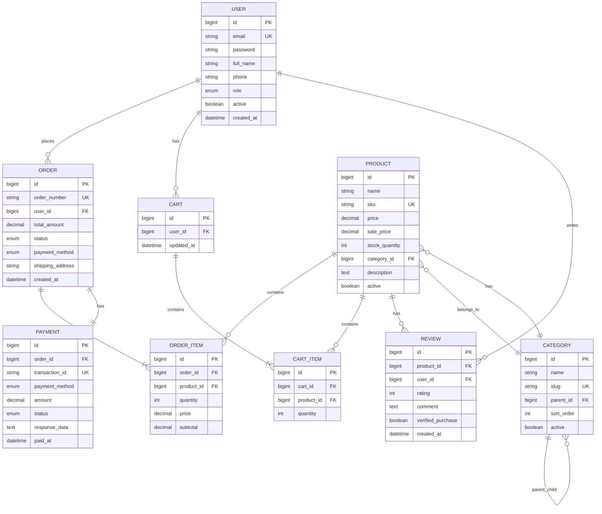

### 📊 Indexes quan trọng:

```sql
-- User indexes
CREATE INDEX idx_user_email ON USER(email);
CREATE INDEX idx_user_role ON USER(role);

-- Product indexes
CREATE INDEX idx_product_category ON PRODUCT(category_id);
CREATE INDEX idx_product_sku ON PRODUCT(sku);
CREATE INDEX idx_product_active ON PRODUCT(active);

-- Order indexes
CREATE INDEX idx_order_user ON ORDER(user_id);
CREATE INDEX idx_order_status ON ORDER(status);
CREATE INDEX idx_order_created_at ON ORDER(created_at);
CREATE INDEX idx_order_number ON ORDER(order_number);

-- Payment indexes
CREATE INDEX idx_payment_order ON PAYMENT(order_id);
CREATE INDEX idx_payment_transaction ON PAYMENT(transaction_id);
CREATE INDEX idx_payment_status ON PAYMENT(status);
```

---

## 🎨 Frontend Structure

### 📁 Thư mục dự án:

```
pet-shop/
├── 📂 src/
│   ├── 📂 main/
│   │   ├── 📂 java/
│   │   │   └── 📂 com/petshop/
│   │   │       ├── 📂 controller/      # REST Controllers
│   │   │       ├── 📂 service/         # Business Logic
│   │   │       ├── 📂 repository/      # Data Access Layer
│   │   │       ├── 📂 model/           # Entity Models
│   │   │       ├── 📂 dto/             # Data Transfer Objects
│   │   │       ├── 📂 config/          # Configurations
│   │   │       ├── 📂 security/        # Security & JWT
│   │   │       ├── 📂 util/            # Utilities
│   │   │       └── 📂 exception/       # Custom Exceptions
│   │   ├── 📂 resources/
│   │   │   ├── 📂 static/
│   │   │   │   ├── 📂 css/
│   │   │   │   ├── 📂 js/
│   │   │   │   └── 📂 images/
│   │   │   ├── 📂 templates/           # Thymeleaf Templates
│   │   │   │   ├── 📂 customer/        # Customer Views
│   │   │   │   ├── 📂 admin/           # Admin Dashboard
│   │   │   │   ├── 📂 staff/           # Staff Panel
│   │   │   │   └── 📂 shared/          # Shared Components
│   │   │   └── application.properties
│   │   └── 📂 webapp/
│   │       └── 📂 uploads/             # User Uploads
│   └── 📂 test/                        # Unit & Integration Tests
├── 📂 docs/                            # Documentation
├── 📂 scripts/                         # Deployment Scripts
├── 📄 pom.xml                          # Maven Dependencies
├── 📄 Dockerfile
├── 📄 docker-compose.yml
└── 📄 README.md
```

---

## 🔒 Security Best Practices

### ✅ Checklist:

- [x] 🔐 **Password Hashing**: BCrypt với salt rounds = 12
- [x] 🔑 **JWT Security**: Signed tokens với secret key
- [x] 🛡️ **CORS Protection**: Whitelist trusted domains
- [x] 🚫 **SQL Injection**: Prepared statements với JPA
- [x] 🔒 **XSS Prevention**: Input sanitization
- [x] 🔐 **CSRF Protection**: CSRF tokens cho forms
- [x] 📝 **Audit Logging**: Log mọi critical actions
- [x] 🚦 **Rate Limiting**: API throttling
- [x] 🔍 **Input Validation**: Bean Validation (JSR-303)
- [x] 🔐 **HTTPS Only**: Force SSL/TLS

### 🛡️ Security Headers:

```java
@Configuration
public class SecurityConfig extends WebSecurityConfigurerAdapter {
    
    @Override
    protected void configure(HttpSecurity http) throws Exception {
        http
            .headers()
                .contentSecurityPolicy("default-src 'self'")
                .and()
                .xssProtection()
                .and()
                .frameOptions().deny()
                .and()
                .httpStrictTransportSecurity()
                    .maxAgeInSeconds(31536000)
                    .includeSubDomains(true);
    }
}
```

---

## 🌟 Performance Optimization

### ⚡ Caching Strategy:

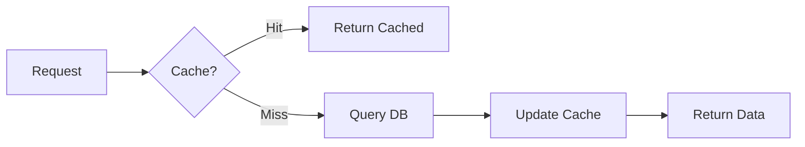

### 🚀 Optimization Tips:

| Kỹ thuật | Mô tả | Hiệu quả |
|----------|--------|----------|
| 💾 Redis Cache | Cache product, category data | ⬆️ 70% |
| 🗜️ Compression | Gzip response data | ⬆️ 60% |
| 🖼️ Image Optimization | WebP format, lazy loading | ⬆️ 50% |
| 📦 DB Indexing | Proper indexes on queries | ⬆️ 80% |
| 🔄 Connection Pooling | HikariCP configuration | ⬆️ 40% |
| ⚡ Async Processing | Non-blocking operations | ⬆️ 65% |

### 📊 Performance Metrics:

```properties
# HikariCP Configuration
spring.datasource.hikari.maximum-pool-size=20
spring.datasource.hikari.minimum-idle=5
spring.datasource.hikari.connection-timeout=30000
spring.datasource.hikari.idle-timeout=600000
spring.datasource.hikari.max-lifetime=1800000

# Redis Cache
spring.cache.type=redis
spring.redis.host=localhost
spring.redis.port=6379
spring.cache.redis.time-to-live=3600000
```

---

## 📚 Code Quality

### 🎯 Code Standards:

- ✅ **Java Code Conventions**
- ✅ **SOLID Principles**
- ✅ **Clean Code Practices**
- ✅ **Design Patterns**: Factory, Builder, Repository
- ✅ **Code Review**: Mandatory PR reviews
- ✅ **Documentation**: JavaDoc for public APIs

### 🧹 Static Analysis:

```xml
<!-- SonarQube Plugin -->
<plugin>
    <groupId>org.sonarsource.scanner.maven</groupId>
    <artifactId>sonar-maven-plugin</artifactId>
    <version>3.9.1.2184</version>
</plugin>
```

**Run analysis:**
```bash
mvn clean verify sonar:sonar
```

### ✅ Code Coverage:

Target: **>= 80% coverage**

```bash
mvn clean test jacoco:report
```

---

## 🌍 Internationalization (i18n)

### 🗣️ Supported Languages:

| Language | Code | Status |
|----------|------|--------|
| 🇻🇳 Tiếng Việt | `vi_VN` | ✅ Default |
| 🇺🇸 English | `en_US` | ✅ Available |
| 🇯🇵 日本語 | `ja_JP` | 🔄 Coming soon |
| 🇰🇷 한국어 | `ko_KR` | 🔄 Coming soon |

### 📝 Message Files:

```properties
# messages_vi_VN.properties
app.title=Cửa Hàng Thú Cưng
app.welcome=Chào mừng bạn đến với Pet Shop

# messages_en_US.properties
app.title=Pet Shop
app.welcome=Welcome to Pet Shop
```

---

## 🤝 Contributing

### 💻 Quy trình đóng góp:

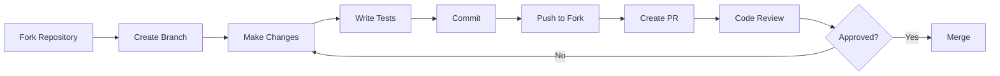

### 📋 Commit Message Convention:

```bash
# Format
<type>(<scope>): <subject>

# Types
feat: New feature
fix: Bug fix
docs: Documentation
style: Formatting
refactor: Code restructuring
test: Adding tests
chore: Maintenance

# Examples
feat(auth): add OAuth2 login
fix(payment): resolve VNPay callback issue
docs(readme): update installation guide
```

### 🎨 Pull Request Template:

```markdown
## 📝 Description
Brief description of changes

## 🎯 Type of Change
- [ ] Bug fix
- [ ] New feature
- [ ] Breaking change
- [ ] Documentation update

## ✅ Checklist
- [ ] Code follows style guidelines
- [ ] Self-review completed
- [ ] Tests added/updated
- [ ] Documentation updated
- [ ] No new warnings
```

---

## 📞 Hỗ trợ và liên hệ

### 🆘 Kênh hỗ trợ:

<div align="center">

| Kênh | Thông tin | Thời gian phản hồi |
|------|-----------|-------------------|
| 📧 **Email** | support@petshop.com | 24/7 - trong 2h |
| 💬 **Live Chat** | Website | 8AM-10PM - tức thì |
| ☎️ **Hotline** | 1800-xxxx | 8AM-10PM - tức thì |
| 📱 **Zalo** | @petshop_official | 8AM-9PM - trong 30 phút |
| 💼 **LinkedIn** | linkedin.com/company/petshop | 1-2 ngày làm việc |
| 🐙 **GitHub Issues** | github.com/petshop/issues | 1-3 ngày |

</div>

### 📮 Liên hệ Development Team:

- 👨‍💻 **Tech Lead**: caongocthien1902@gmail.com
- 🎨 **UI/UX Designer**: design@petshop.com
- 🔐 **Security Team**: security@petshop.com
- 📊 **DevOps**: devops@petshop.com

### 🐛 Báo lỗi (Bug Report):

1. Truy cập: https://github.com/petshop/issues
2. Click **"New Issue"**
3. Chọn template **"Bug Report"**
4. Điền đầy đủ thông tin:
   - ✅ Mô tả lỗi chi tiết
   - ✅ Các bước tái hiện
   - ✅ Expected vs Actual behavior
   - ✅ Screenshots (nếu có)
   - ✅ Environment info
   - ✅ Log files

### 💡 Đề xuất tính năng (Feature Request):

1. Kiểm tra roadmap hiện tại
2. Tìm kiếm feature requests có sẵn
3. Tạo issue mới với template **"Feature Request"**
4. Mô tả chi tiết use case và benefits

---

## 📜 License

```
MIT License

Copyright (c) 2024 Pet Shop Application

Permission is hereby granted, free of charge, to any person obtaining a copy
of this software and associated documentation files (the "Software"), to deal
in the Software without restriction, including without limitation the rights
to use, copy, modify, merge, publish, distribute, sublicense, and/or sell
copies of the Software, and to permit persons to whom the Software is
furnished to do so, subject to the following conditions:

The above copyright notice and this permission notice shall be included in all
copies or substantial portions of the Software.

THE SOFTWARE IS PROVIDED "AS IS", WITHOUT WARRANTY OF ANY KIND, EXPRESS OR
IMPLIED, INCLUDING BUT NOT LIMITED TO THE WARRANTIES OF MERCHANTABILITY,
FITNESS FOR A PARTICULAR PURPOSE AND NONINFRINGEMENT. IN NO EVENT SHALL THE
AUTHORS OR COPYRIGHT HOLDERS BE LIABLE FOR ANY CLAIM, DAMAGES OR OTHER
LIABILITY, WHETHER IN AN ACTION OF CONTRACT, TORT OR OTHERWISE, ARISING FROM,
OUT OF OR IN CONNECTION WITH THE SOFTWARE OR THE USE OR OTHER DEALINGS IN THE
SOFTWARE.
```

---

## 🎓 Learning Resources

### 📚 Documentation:

- 📖 [Spring Boot Documentation](https://spring.io/projects/spring-boot)
- 🔐 [Spring Security Reference](https://docs.spring.io/spring-security/reference/)
- 💾 [Hibernate ORM Guide](https://hibernate.org/orm/documentation/)
- 🐳 [Docker Documentation](https://docs.docker.com/)

### 🎥 Video Tutorials:

- 🎬 [Spring Boot Crash Course](https://youtube.com/springboot)
- 🎬 [Microservices Architecture](https://youtube.com/microservices)
- 🎬 [Docker & Kubernetes](https://youtube.com/devops)

### 📝 Blog Posts:

- ✍️ [Building Scalable E-commerce Apps](https://blog.petshop.com/scalable-apps)
- ✍️ [Payment Gateway Integration](https://blog.petshop.com/payment-integration)
- ✍️ [Securing Spring Boot Apps](https://blog.petshop.com/spring-security)

---

## 🏆 Credits & Acknowledgments

### 👥 Core Team:

<div align="center">

| Role | Name | Contact |
|------|------|---------|
| 🎯 **Project Lead** | Cao Ngọc Thiện | caongocthien1902@gmail.com |
| 💻 **Backend Developer** | Development Team | dev@petshop.com |
| 🎨 **UI/UX Designer** | Design Team | design@petshop.com |
| 🧪 **QA Engineer** | Testing Team | qa@petshop.com |
| 📝 **Technical Writer** | Documentation Team | docs@petshop.com |

</div>

### 🌟 Special Thanks:

- ☕ Spring Boot Community
- 🐘 Hibernate Team
- 🔐 Spring Security Team
- 💳 VNPay & MoMo Developer Teams
- 🐳 Docker Community
- 🎓 Stack Overflow Community

### 🔧 Tools & Technologies:

Built with ❤️ using:

- ☕ **Java 8+**
- 🍃 **Spring Boot 2.x**
- 🐘 **Hibernate ORM**
- 🗄️ **SQL Server**
- 💾 **Redis**
- 🐳 **Docker**
- 📊 **Maven**
- 🎨 **Thymeleaf**
- 🔐 **JWT**
- 💳 **VNPay & MoMo API**

---

## 📈 Statistics

<div align="center">

### 📊 Project Status


</div>

---

## 🎉 Changelog

### Version 1.0.0 (2024-01-15)

#### ✨ Features:
- 🔐 User authentication & authorization
- 🛍️ Product catalog & management
- 🛒 Shopping cart functionality
- 💳 Multiple payment methods (VNPay, MoMo, COD)
- 📦 Order management system
- 👥 User profile management
- ⭐ Product review & rating
- 📧 Email notification system
- 📱 Responsive design
- 🔍 Advanced search & filtering

#### 🐛 Bug Fixes:
- Fixed payment callback issues
- Resolved cart synchronization problems
- Fixed image upload limitations

#### 🔒 Security:
- Implemented JWT authentication
- Added rate limiting
- Enhanced password encryption
- CSRF protection

---

<div align="center">

## ⭐ Support This Project

If you find this project helpful, please consider:

- ⭐ Starring the repository
- 🐛 Reporting bugs
- 💡 Suggesting new features
- 📖 Improving documentation
- 🤝 Contributing code

---

### 🚀 Made with ❤️ by Pet Shop Team

**🐾 Happy Coding! 🐾**


</div>
