# 🐾 Pet Shop Application

<div align="center">


**Ứng dụng quản lý cửa hàng thú cưng hiện đại - Nơi chăm sóc thú cưng tốt nhất**

[🚀 Bắt đầu ngay](#-cài-đặt-và-chạy-ứng-dụng) | [📖 Hướng dẫn sử dụng](#-hướng-dẫn-sử-dụng-chi-tiết-theo-vai-trò) | [🛠 Hỗ trợ](#-hỗ-trợ-và-liên-hệ)

</div>

## 📋 Giới thiệu

Chào mừng bạn đến với **Pet Shop** - Ứng dụng web quản lý cửa hàng thú cưng toàn diện! 🎉

Hệ thống được phát triển bằng Spring Boot, mang đến trải nghiệm mua sắm và quản lý tuyệt vời cho cộng đồng yêu thú cưng.

### 👥 Các vai trò trong hệ thống

<div align="center">

| Vai trò | Icon | Mô tả | Quyền hạn |
|---------|------|--------|------------|
| **Khách hàng** | 👤 | Người dùng cuối, mua sắm và quản lý đơn hàng | Mua sắm, theo dõi đơn hàng, đánh giá |
| **Nhân viên** | 👨‍💼 | Xử lý đơn hàng và hỗ trợ khách hàng | Quản lý đơn hàng, sản phẩm, hỗ trợ |
| **Quản trị viên** | 👨‍💻 | Quản lý toàn bộ hệ thống | Toàn quyền quản trị và phân quyền |

</div>

## 🎯 Hướng dẫn sử dụng chi tiết theo vai trò

### 🛍️ Dành cho Khách hàng (USER)

<details>
<summary><b>🎁 Trải nghiệm mua sắm toàn diện</b></summary>

#### 🔐 Đăng ký tài khoản mới

<div align="center">

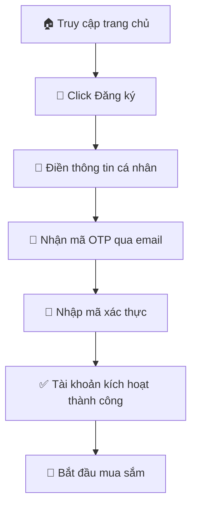

</div>

**Thông tin đăng ký cần thiết:**
- 👤 **Họ và tên** (bắt buộc)
- 📧 **Email** (dùng để đăng nhập)
- 📱 **Số điện thoại**
- 🔒 **Mật khẩu** (tối thiểu 6 ký tự)
- 🔐 **Xác nhận mật khẩu**

#### 🔑 Đăng nhập hệ thống

<div align="center">

| Bước | Thao tác | Ghi chú |
|------|----------|----------|
| 1️⃣ | Click "Đăng nhập" | Góc trên bên phải |
| 2️⃣ | Nhập email và mật khẩu | Email đã đăng ký |
| 3️⃣ | Chọn "Ghi nhớ đăng nhập" | Tùy chọn |
| 4️⃣ | Click "Đăng nhập" | Xác thực thành công |

</div>

#### 👤 Quản lý thông tin cá nhân

<div align="center">

| Tính năng | Icon | Mô tả | Truy cập |
|-----------|------|--------|-----------|
| **Thông tin cơ bản** | 📝 | Cập nhật họ tên, số điện thoại, ngày sinh | Tài khoản → Thông tin cá nhân |
| **Đổi mật khẩu** | 🔒 | Thay đổi mật khẩu đăng nhập | Tài khoản → Bảo mật |
| **Cập nhật avatar** | 🖼️ | Tải lên ảnh đại diện mới | Tài khoản → Ảnh đại diện |
| **Địa chỉ giao hàng** | 📍 | Quản lý địa chỉ nhận hàng | Tài khoản → Địa chỉ |

</div>

#### 🛒 Hướng dẫn mua sắm

<details>
<summary><b>🔍 Tìm kiếm sản phẩm</b></summary>

- **🏠 Lướt trang chủ**: Khám phá sản phẩm nổi bật
- **🔎 Thanh tìm kiếm**: Tìm kiếm thông minh theo tên, mô tả
- **📑 Lọc theo danh mục**: Chó, mèo, thức ăn, phụ kiện...
- **⚡ Sắp xếp**: Theo giá, tên, mới nhất, bán chạy

</details>

<details>
<summary><b>📦 Xem chi tiết sản phẩm</b></summary>

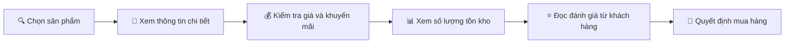

</details>

<details>
<summary><b>🛍️ Thêm vào giỏ hàng</b></summary>

<div align="center">

| Thao tác | Kết quả | Hướng dẫn |
|----------|---------|-----------|
| **Chọn số lượng** | Hiển thị số lượng | Sử dụng nút +/- hoặc nhập trực tiếp |
| **Thêm vào giỏ** | Sản phẩm được thêm | Click "Thêm vào giỏ hàng" |
| **Thông báo** | Xác nhận thành công | Hiện popup thông báo |
| **Tiếp tục** | Mua thêm hoặc xem giỏ | Chọn hành động tiếp theo |

</div>

</details>

#### 🛒 Quản lý giỏ hàng

<div align="center">

| Chức năng | Icon | Mô tả | Thao tác |
|-----------|------|--------|----------|
| **Xem giỏ hàng** | 📋 | Danh sách sản phẩm đã chọn | Click icon giỏ hàng |
| **Cập nhật số lượng** | ⚖️ | Tăng/giảm số lượng sản phẩm | Click +/- hoặc nhập số |
| **Xóa sản phẩm** | 🗑️ | Loại bỏ sản phẩm khỏi giỏ | Click icon thùng rác |
| **Tính tổng tiền** | 💰 | Tự động tính tổng và khuyến mãi | Hiển thị real-time |

</div>

#### 💳 Hướng dẫn thanh toán

<div align="center">

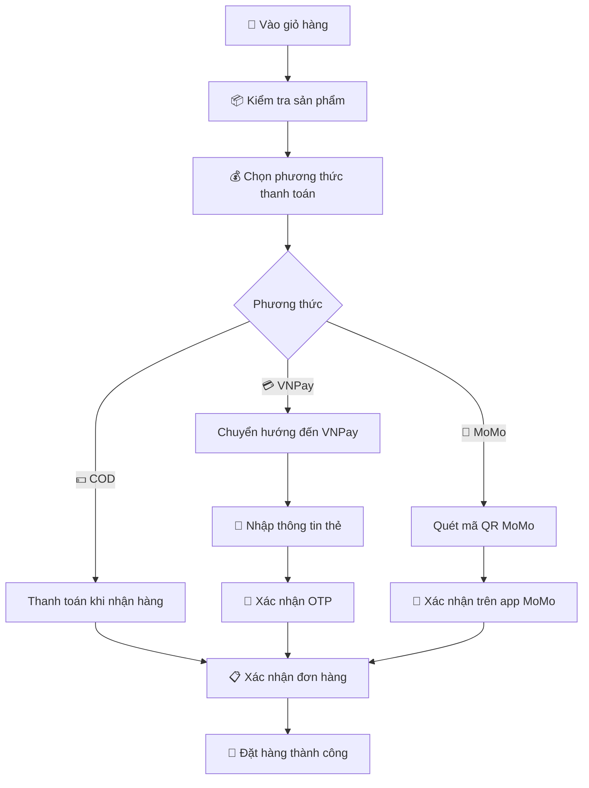

</div>

**📋 Lưu ý quan trọng:**
- 🏠 **COD**: Thanh toán khi nhận hàng, kiểm tra hàng trước khi trả tiền
- 💳 **VNPay**: Hỗ trợ thẻ ATM, Visa, Mastercard
- 📱 **MoMo**: Thanh toán nhanh qua ví điện tử

#### 📦 Theo dõi đơn hàng

<div align="center">

| Trạng thái | Icon | Mô tả | Hành động |
|------------|------|--------|-----------|
| **Chờ xác nhận** | ⏳ | Đơn hàng mới tạo | Có thể hủy đơn |
| **Đang xử lý** | 🔄 | Đang chuẩn bị hàng | Liên hệ hỗ trợ nếu cần |
| **Đang giao** | 🚚 | Đang vận chuyển | Theo dõi lộ trình |
| **Đã giao** | ✅ | Giao hàng thành công | Đánh giá sản phẩm |
| **Đã hủy** | ❌ | Đơn hàng bị hủy | Xem lý do hủy |

</div>

<details>
<summary><b>📋 Chi tiết đơn hàng</b></summary>

- **📝 Thông tin sản phẩm**: Tên, số lượng, giá
- **🔍 Trạng thái realtime**: Cập nhật tự động
- **📅 Lịch sử giao hàng**: Thời gian các bước
- **💬 Liên hệ shop**: Hỗ trợ trực tiếp

</details>

<details>
<summary><b>❌ Hướng dẫn hủy đơn hàng</b></summary>

> ⚠️ **Điều kiện hủy đơn:**
> - 🕒 Đơn hàng ở trạng thái "Chờ xác nhận"
> - 📝 Cung cấp lý do hủy hợp lệ
> - ⏰ Trong vòng 30 phút sau khi đặt

**Quy trình hủy đơn:**
1. Vào "Quản lý đơn hàng"
2. Chọn đơn muốn hủy
3. Click "Hủy đơn hàng"
4. Chọn lý do hủy
5. Xác nhận hủy đơn

</details>

<details>
<summary><b>⭐ Đánh giá sản phẩm</b></summary>

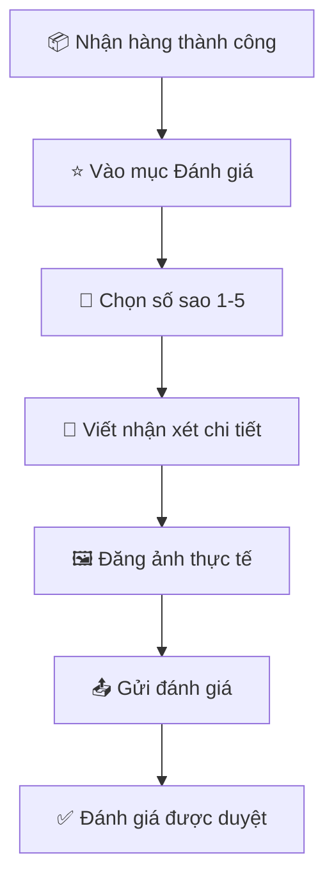

</details>

</details>

### 👨‍💼 Dành cho Nhân viên (STAFF)

<details>
<summary><b>🛠️ Hướng dẫn quản lý cửa hàng</b></summary>

#### 🔐 Truy cập hệ thống quản lý

<div align="center">

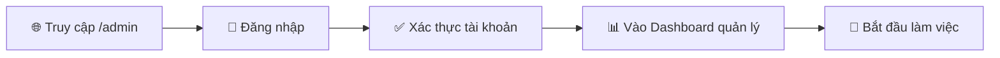

</div>

#### 📦 Quản lý đơn hàng chuyên nghiệp

<div align="center">

| Chức năng | Icon | Mô tả | Thao tác |
|-----------|------|--------|----------|
| **Xem danh sách** | 📋 | Lọc & Tìm kiếm đơn hàng | Sử dụng bộ lọc nâng cao |
| **Xác nhận đơn** | ✅ | Duyệt đơn hàng mới | Kiểm tra thông tin khách hàng |
| **In hóa đơn** | 🖨️ | Xuất hóa đơn PDF | Click "In hóa đơn" |
| **Thêm ghi chú** | 📝 | Ghi chú nội bộ | Cập nhật thông tin đơn hàng |

</div>

#### 🚚 Quản lý vận chuyển

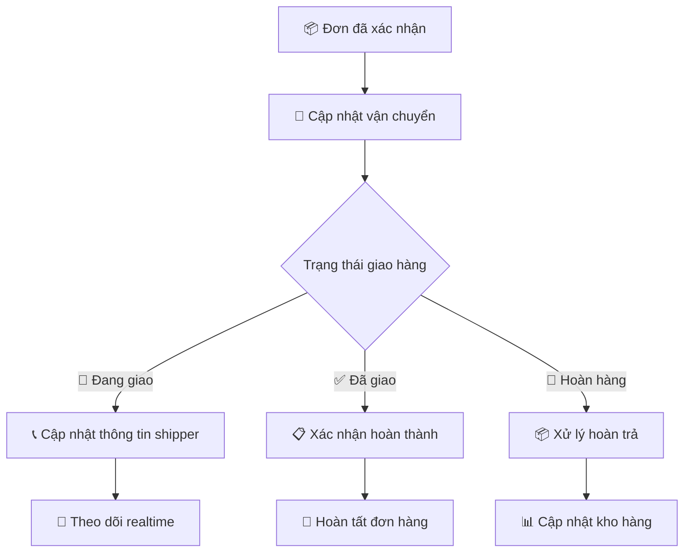

#### 📦 Quản lý sản phẩm

<div align="center">

| Tính năng | Icon | Mô tả | Quyền hạn |
|-----------|------|--------|------------|
| **Xem kho hàng** | 📊 | Kiểm tra tồn kho realtime | Xem toàn bộ |
| **Tìm kiếm** | 🔍 | Lọc theo danh mục, từ khóa | Tìm kiếm nâng cao |
| **Cập nhật thông tin** | ✏️ | Sửa thông tin sản phẩm | Cập nhật cơ bản |
| **Quản lý hình ảnh** | 🖼️ | Thêm/xóa ảnh sản phẩm | Upload ảnh mới |

</div>

<details>
<summary><b>📝 Quy trình cập nhật sản phẩm</b></summary>

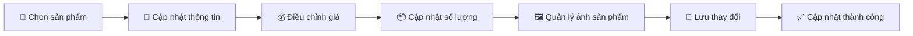

</details>

#### 💬 Hỗ trợ khách hàng chuyên nghiệp

<div align="center">

| Nhiệm vụ | Icon | Thao tác | Tiêu chuẩn |
|----------|------|----------|------------|
| **Tiếp nhận yêu cầu** | 📩 | Kiểm tra & phân loại | Phản hồi trong 5 phút |
| **Trả lời khách hàng** | 💬 | Chat trực tiếp/Email | Thân thiện, chuyên nghiệp |
| **Giải quyết vấn đề** | ✅ | Cập nhật trạng thái | Theo dõi đến khi hoàn thành |

</div>

> 💡 **Mẹo hỗ trợ hiệu quả:**
> - ⚡ **Phản hồi nhanh**: Trong vòng 5 phút
> - 😊 **Thái độ**: Thân thiện, nhiệt tình
> - 📝 **Ghi chú**: Chi tiết, đầy đủ thông tin
> - 📊 **Theo dõi**: Mức độ hài lòng khách hàng

</details>

### 👨‍💻 Dành cho Quản trị viên (ADMIN)

<details>
<summary><b>⚙️ Quản trị hệ thống toàn diện</b></summary>

#### 📊 Dashboard & Thống kê

<div align="center">

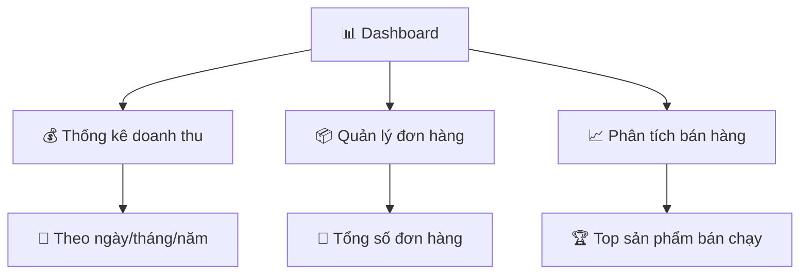

</div>

#### ⚙️ Cấu hình hệ thống

<div align="center">

| Cấu hình | Icon | Chức năng | Mức độ quan trọng |
|----------|------|-----------|-------------------|
| **Thông tin shop** | 🏪 | Cập nhật thông tin cửa hàng | 🔴 Cao |
| **Cấu hình Email** | 📧 | Thiết lập SMTP, mẫu email | 🔴 Cao |
| **Thanh toán** | 💳 | Cài đặt VNPay, MoMo | 🔴 Cao |
| **Giao diện** | 🎨 | Quản lý banner, slider | 🟡 Trung bình |

</div>

#### 📁 Quản lý danh mục sản phẩm

<div align="center">

| Chức năng | Icon | Mô tả | Phím tắt |
|-----------|------|--------|----------|
| **Thêm mới** | ➕ | Tạo danh mục mới | `Alt + N` |
| **Chỉnh sửa** | 📝 | Cập nhật thông tin | `Alt + E` |
| **Xóa** | 🗑️ | Xóa danh mục | `Alt + D` |
| **Sắp xếp** | 📊 | Điều chỉnh thứ tự hiển thị | `Alt + S` |

</div>

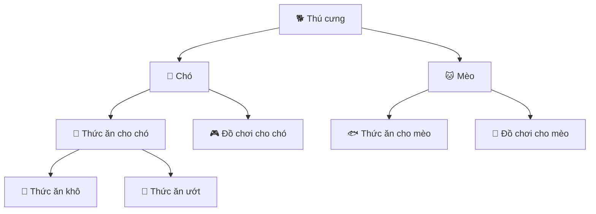

#### 🛍️ Quản lý sản phẩm toàn quyền

<details>
<summary><b>✨ Thêm sản phẩm mới</b></summary>

<div align="center">

| Bước | Thông tin | Icon | Ghi chú |
|------|-----------|------|----------|
| **1️⃣** | Thông tin cơ bản | 📝 | Tên, mã, danh mục |
| **2️⃣** | Giá & Khuyến mãi | 💰 | Giá bán, giá khuyến mãi |
| **3️⃣** | Hình ảnh | 🖼️ | Tối đa 8 ảnh, dung lượng < 10MB |
| **4️⃣** | SEO | 🔍 | Meta title, description |

</div>

</details>

<details>
<summary><b>📦 Quản lý kho hàng</b></summary>

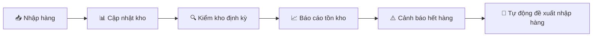

</details>

<details>
<summary><b>💰 Quản lý giá & Khuyến mãi</b></summary>

| Tính năng | Icon | Mô tả | Thời gian áp dụng |
|-----------|------|--------|-------------------|
| **Giá cơ bản** | 💵 | Giá niêm yết | 24/7 |
| **Flash Sale** | ⚡ | Giảm giá sốc | Theo giờ |
| **Combo** | 🎁 | Mua nhiều giảm nhiều | Theo ngày |
| **Mùa vụ** | 🎄 | Khuyến mãi theo mùa | Theo tháng |

</details>

#### 👥 Quản lý người dùng

<details>
<summary><b>👤 Quản lý khách hàng</b></summary>

<div align="center">

| Chức năng | Icon | Thao tác | Phím tắt |
|-----------|------|----------|----------|
| **Xem danh sách** | 👀 | Lọc & Tìm kiếm | `Ctrl + F` |
| **Khóa tài khoản** | 🔒 | Tạm khóa/Vĩnh viễn | `Ctrl + L` |
| **Reset mật khẩu** | 🔑 | Gửi email reset | `Ctrl + R` |
| **Thống kê** | 📊 | Phân tích hành vi | `Ctrl + A` |

</div>

</details>

<details>
<summary><b>👨‍💼 Quản lý nhân viên</b></summary>

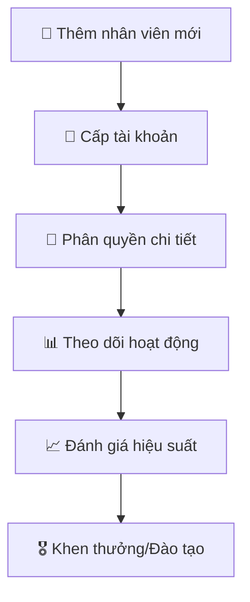

#### 🔐 Hệ thống phân quyền chi tiết

<div align="center">

| Module | 👤 USER | 👨‍💼 STAFF | 👨‍💻 ADMIN |
|--------|---------|-----------|------------|
| **Đơn hàng** | ⚡ | ✅ | ✅ |
| **Sản phẩm** | ⚡ | ⚡ | ✅ |
| **Khách hàng** | ❌ | ⚡ | ✅ |
| **Tài chính** | ❌ | ❌ | ✅ |
| **Cấu hình** | ❌ | ❌ | ✅ |

</div>

> **Chú thích:** 
> - ✅ **Full quyền**: Toàn quyền thao tác
> - ⚡ **Hạn chế**: Một số chức năng nhất định
> - ❌ **Không có quyền**: Không thể truy cập

</details>

#### 💰 Quản lý tài chính & Báo cáo

<div align="center">

| Báo cáo | Icon | Thời gian | Biểu đồ |
|---------|------|-----------|----------|
| **Doanh thu** | 📈 | Ngày/Tuần/Tháng | Line chart |
| **Sản phẩm** | 📊 | Top bán chạy | Bar chart |
| **Thanh toán** | 💳 | Phương thức | Pie chart |
| **Hoàn tiền** | 🔄 | Theo trạng thái | Status chart |

</div>

<details>
<summary><b>💹 Phân tích tài chính nâng cao</b></summary>

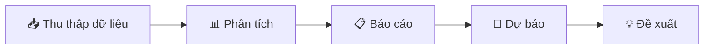

#### 📊 Các chỉ số quan trọng (KPIs)

| Chỉ số | Đơn vị | Mục tiêu | Xu hướng |
|--------|---------|-----------|----------|
| **Doanh thu** | VNĐ | Tăng 15%/tháng | 📈 |
| **Lợi nhuận** | % | > 25% | 📊 |
| **Đơn hàng** | Số lượng | Tăng 10%/tháng | 📋 |
| **Khách hàng** | Tăng trưởng | +100 khách/tháng | 👥 |

</details>

</details>

## 🚀 Cài đặt và Chạy ứng dụng

### 📋 Yêu cầu hệ thống

<div align="center">

| Thành phần | Phiên bản | Ghi chú |
|------------|-----------|----------|
| **Java Development Kit** | 8+ | Khuyến nghị JDK 11 |
| **Maven** | 3.6+ | Quản lý dependencies |
| **SQL Server** | 2012+ | Database chính |
| **IDE** | - | Eclipse hoặc IntelliJ IDEA |

</div>

### ⚙️ Các bước cài đặt

#### 1. Cấu hình Database

```sql
-- Tạo database mới
CREATE DATABASE DTA_PET;

-- Cập nhật cấu hình trong application.properties
spring.datasource.url=jdbc:sqlserver://localhost:1433;databaseName=DTA_PET
spring.datasource.username=sa
spring.datasource.password=123456
```

#### 2. Clone và chạy ứng dụng

```bash
# 1. Clone repository
git clone https://github.com/your-repo/pet-shop.git

# 2. Di chuyển vào thư mục dự án
cd pet-shop

# 3. Chạy ứng dụng với Maven
mvn spring-boot:run

# 4. Truy cập ứng dụng
# Frontend: http://localhost:8080
# Admin: http://localhost:8080/admin
```

#### 3. Cấu hình môi trường

Tạo file `application-dev.properties` để cấu hình môi trường phát triển:

```properties
# Email configuration
spring.mail.host=smtp.gmail.com
spring.mail.port=587
spring.mail.username=your-email@gmail.com
spring.mail.password=your-app-password

# Payment configuration
vnpay.payment.url=https://sandbox.vnpayment.vn/paymentv2/vpcpay.html
vnpay.return.url=http://localhost:8080/payment/vnpay-callback

# File upload configuration
spring.servlet.multipart.max-file-size=10MB
spring.servlet.multipart.max-request-size=10MB
```

## 🔧 Xử lý lỗi thường gặp

### 🐛 Các sự cố phổ biến và giải pháp

<details>
<summary><b>🔌 Lỗi kết nối database</b></summary>

**Triệu chứng:**
- ❌ Ứng dụng không khởi động được
- 📛 Lỗi "Cannot connect to SQL Server"

**Giải pháp:**
1. ✅ Kiểm tra SQL Server đang chạy
2. ✅ Xác nhận thông tin kết nối trong `application.properties`
3. ✅ Đảm bảo database `DTA_PET` đã được tạo
4. ✅ Kiểm tra quyền truy cập của user

```bash
# Kiểm tra kết nối SQL Server
telnet localhost 1433
```

</details>

<details>
<summary><b>💳 Lỗi thanh toán</b></summary>

**Triệu chứng:**
- ❌ Giao dịch thất bại
- 📛 Lỗi "Payment gateway error"

**Giải pháp:**
1. ✅ Kiểm tra cấu hình VNPay/MoMo
2. ✅ Xác nhận đường dẫn callback
3. ✅ Kiểm tra log để xem chi tiết lỗi
4. ✅ Liên hệ nhà cung cấp dịch vụ thanh toán

```java
// Kiểm tra log thanh toán
tail -f logs/payment.log
```

</details>

<details>
<summary><b>📤 Lỗi upload file</b></summary>

**Triệu chứng:**
- ❌ Không thể tải lên hình ảnh
- 📛 Lỗi "File upload failed"

**Giải pháp:**
1. ✅ Kiểm tra thư mục `uploads` có tồn tại
2. ✅ Đảm bảo có quyền ghi vào thư mục
3. ✅ Kiểm tra kích thước file (< 10MB)
4. ✅ Xác nhận định dạng file được hỗ trợ

```bash
# Tạo thư mục uploads nếu chưa tồn tại
mkdir -p uploads/images
chmod 755 uploads/images
```

</details>

## 🔄 Quy trình làm việc và bảo mật

### 📦 Quy trình xử lý đơn hàng

<div align="center">


</div>

<details>
<summary><b>📋 Chi tiết các trạng thái đơn hàng</b></summary>

<div align="center">

| Trạng thái | Icon | Mô tả | Thao tác cho phép |
|------------|------|--------|-------------------|
| **NEW** | 🆕 | Đơn hàng mới tạo | Hủy đơn, Chỉnh sửa |
| **CONFIRMED** | ✅ | Đã xác nhận thông tin | Chuẩn bị hàng |
| **PROCESSING** | 🔄 | Đang đóng gói | Cập nhật tiến độ |
| **SHIPPING** | 🚚 | Đang vận chuyển | Theo dõi lộ trình |
| **DELIVERED** | 📦 | Đã giao đến khách | Xác nhận nhận hàng |
| **COMPLETED** | ✨ | Hoàn tất đơn hàng | Đánh giá sản phẩm |
| **FAILED** | ❌ | Giao hàng thất bại | Xử lý lại/Hoàn tiền |
| **CANCELLED** | 🚫 | Đã hủy | Xem lý do hủy |

</div>

</details>

### ⚠️ Quy trình xử lý khiếu nại

<div align="center">

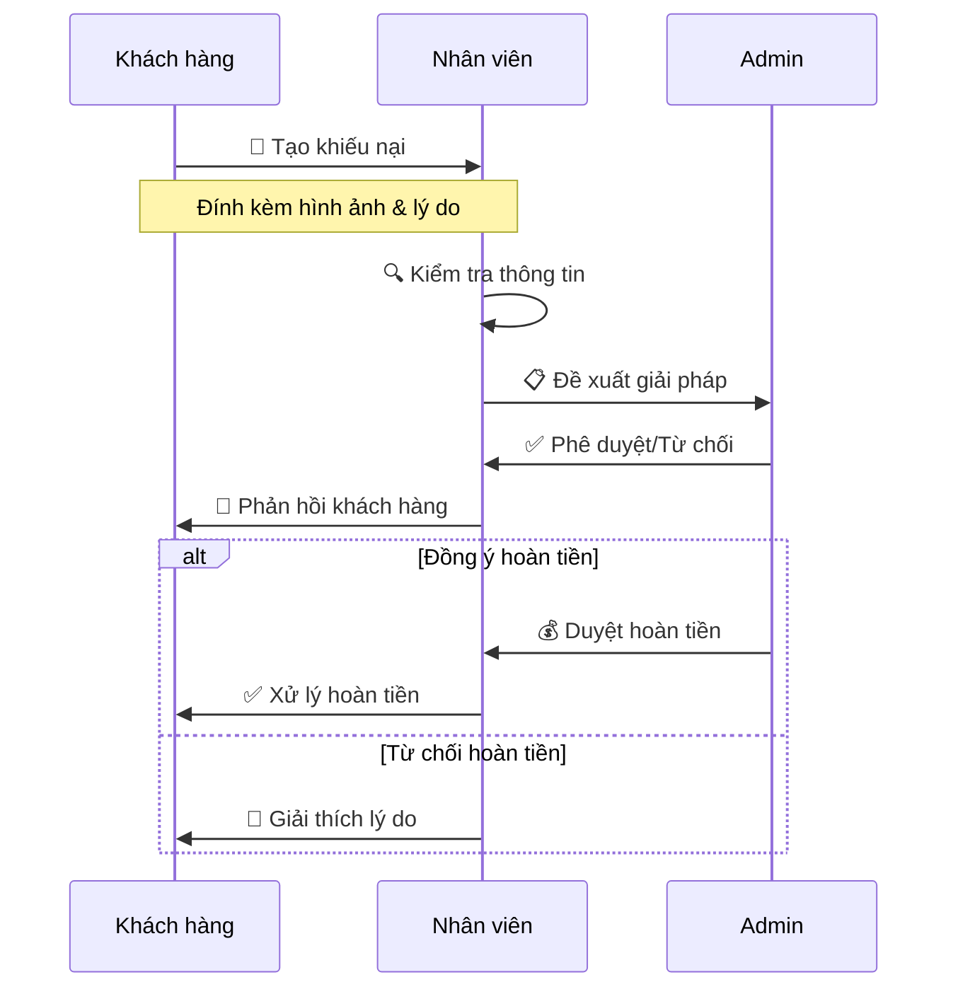

</div>

### 🛡️ Hệ thống bảo mật

<details>
<summary><b>🔒 Các lớp bảo mật</b></summary>

<div align="center">

| Lớp bảo mật | Icon | Công nghệ | Mô tả |
|-------------|------|-----------|--------|
| **Xác thực** | 🔐 | JWT + OAuth2 | Quản lý phiên đăng nhập an toàn |
| **Mã hóa** | 🔒 | BCrypt | Bảo vệ mật khẩu người dùng |
| **API Security** | 🛡️ | Spring Security | Kiểm soát truy cập API |
| **2FA** | 📱 | Google Authenticator | Xác thực 2 lớp cho admin |

</div>

</details>

<details>
<summary><b>🚦 Kiểm soát truy cập</b></summary>

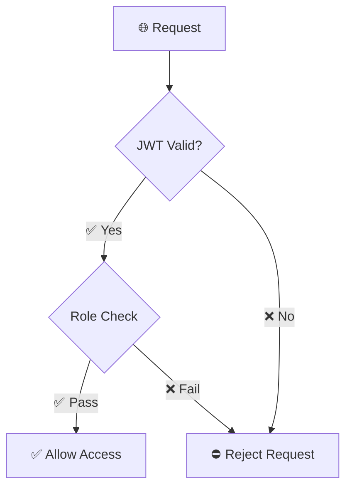

#### 🔑 Ma trận phân quyền chi tiết

<div align="center">

| Tài nguyên | 👤 Anonymous | 👤 User | 👨‍💼 Staff | 👨‍💻 Admin |
|------------|--------------|---------|------------|------------|
| **Xem sản phẩm** | ✅ | ✅ | ✅ | ✅ |
| **Đặt hàng** | ❌ | ✅ | ✅ | ✅ |
| **Quản lý đơn** | ❌ | ⚡ | ✅ | ✅ |
| **Quản lý sản phẩm** | ❌ | ❌ | ⚡ | ✅ |
| **Quản lý người dùng** | ❌ | ❌ | ❌ | ✅ |
| **Cấu hình hệ thống** | ❌ | ❌ | ❌ | ✅ |

</div>

> **Chú thích:**
> - ✅ **Được phép**: Toàn quyền truy cập
> - ⚡ **Hạn chế**: Một số chức năng nhất định
> - ❌ **Không được phép**: Không thể truy cập

</details>

## 📞 Hỗ trợ và liên hệ

<div align="center">

| Kênh hỗ trợ | Icon | Thông tin | Thời gian làm việc |
|-------------|------|-----------|-------------------|
| **Email** | 📧 | support@petshop.com | 24/7 |
| **Hotline** | ☎️ | 1800-xxxx | 8:00 - 22:00 |
| **Live Chat** | 💬 | Website/App | 24/7 |
| **Zalo** | 📱 | @petshop | 8:00 - 21:00 |

</div>

### 🕒 Thời gian phản hồi dự kiến

<div align="center">

| Mức độ ưu tiên | Icon | Thời gian phản hồi | Phương thức |
|----------------|------|---------------------|-------------|
| **Khẩn cấp** | ⚡ | 15 phút | Hotline |
| **Thông thường** | 🔄 | 2 giờ | Email, Live Chat |
| **Góp ý** | 📝 | 24 giờ | Email |

</div>

### 🐛 Báo cáo lỗi

Nếu bạn phát hiện lỗi hoặc có đề xuất cải tiến, vui lòng:

1. **📝 Mô tả chi tiết** vấn đề gặp phải
2. **🖼️ Đính kèm hình ảnh** minh họa (nếu có)
3. **🔍 Cung cấp các bước** để tái hiện lỗi
4. **📧 Gửi về** caongocthien1902@gmail.com

---
<div align="center">

## 🌟 Cảm ơn bạn đã sử dụng Pet Shop! 🐾

**Mang đến niềm vui cho thú cưng - Trao gửi yêu thương đến gia đình bạn**

[⬆️ Quay lại đầu trang](#-pet-shop-application)

</div>
